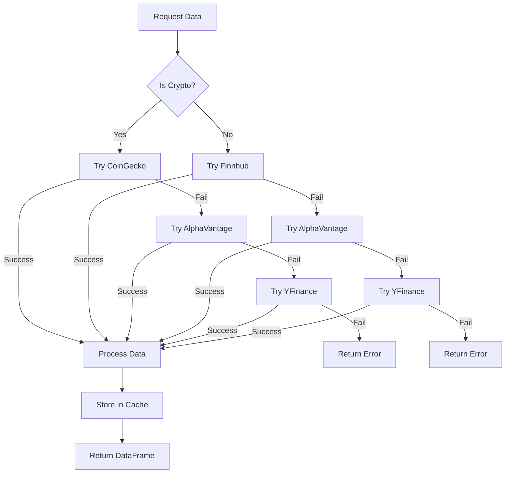
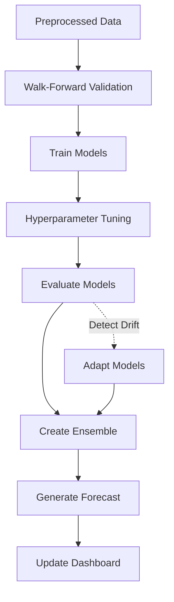
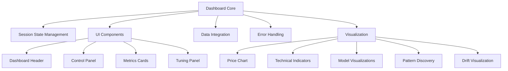

# Prediction Model Codebase Intelligence Map

This analysis provides a comprehensive overview of the Prediction Model codebase, detailing its architecture, components, data flows, and dependencies.

## 1. Codebase Structure Overview

### 1.1 Directory Hierarchy

The codebase is organized into the following main directories:

```
Prediction Model/
├── app/                  # Streamlit application entry points
├── checkpoints/          # Model checkpoints storage
├── config/               # Configuration files
├── data_cache/           # Cache for fetched data
├── dependencies_setup/   # Environment setup scripts
├── docs/                 # Documentation
├── model_weights/        # Saved model weights
├── saved_models/         # Saved model artifacts
├── src/                  # Core source code
│   ├── dashboard/        # Dashboard UI and visualization
│   ├── data/             # Data fetching and preprocessing
│   ├── features/         # Feature engineering
│   ├── models/           # Model implementations
│   ├── training/         # Training and validation logic
│   ├── tuning/           # Hyperparameter optimization
│   └── utils/            # Utility functions
├── static/               # Static assets (CSS, images)
└── tests/                # Testing modules
```

### 1.2 Core Components

1. **Data Pipeline**: Fetches financial data (crypto/stocks), performs preprocessing, and creates features
2. **Model System**: Implementations of various model architectures (neural, tree-based, ensemble)
3. **Training System**: Walk-forward validation, incremental learning, drift detection
4. **Tuning System**: Hyperparameter optimization using Optuna
5. **Dashboard**: Interactive visualization and monitoring using Streamlit

### 1.3 Entry Points

- `launcher.py`: Main entry point that launches the Streamlit dashboard
- `run_dashboard.bat`: Windows batch script to start the dashboard
- `app/launcher.py`: Alternative app entry point
- `src/tuning/launcher.py`: Entry point for tuning processes

## 2. Data Flow Analysis

### 2.1 Data Acquisition

The system fetches financial data through multiple providers with fallback mechanisms:



Data sources:
- CoinGecko API (for cryptocurrencies)
- Finnhub API (stocks and some crypto)
- Alpha Vantage API (stocks and crypto)
- YFinance (fallback for all)

### 2.2 Preprocessing Pipeline

1. Data validation and cleaning
2. Feature engineering
3. Sequence creation for time series models
4. Train/validation split
5. Normalization and scaling

### 2.3 Model Training Flow



## 3. Model Architecture Analysis

### 3.1 Model Types

The system implements and supports multiple model architectures:

| Model Type | Implementation | Category | Description |
|------------|----------------|----------|-------------|
| LSTM | Neural Network | RNN-based | Long Short-Term Memory network for sequence modeling |
| RNN | Neural Network | RNN-based | Basic Recurrent Neural Network |
| CNN | Neural Network | Convolutional | Convolutional Neural Network adapted for time series |
| TabNet | Neural Network | Attention-based | Interpretable model with feature selection |
| TFT | Neural Network | Attention-based | Temporal Fusion Transformer with attention mechanisms |
| N-BEATS | Neural Network | Deep | Neural basis expansion for time series forecasting |
| LTC | Neural Network | RNN-based | Liquid Time-Constant networks |
| Random Forest | Tree-based | Ensemble | Random Forest Regressor |
| XGBoost | Tree-based | Ensemble | Gradient Boosted Trees |

### 3.2 Model Factory Pattern

The system uses a factory pattern (`ModelFactory`) to create and configure different model types:

```python
class ModelFactory:
    @staticmethod
    def create_model(model_type: str, params: Dict[str, Any] = None) -> Any:
        # Maps model_type to creation functions
        creation_map = {
            "linear": ModelFactory._create_linear_model,
            "lstm": ModelFactory._create_neural_network_model,
            "rnn": ModelFactory._create_neural_network_model,
            "tft": ModelFactory._create_tft_model,
            "nbeats": ModelFactory._create_nbeats_model,
            "tabnet": ModelFactory._create_tabnet_model,
            "random_forest": ModelFactory._create_random_forest_model,
            "xgboost": ModelFactory._create_xgboost_model,
            "ensemble": ModelFactory._create_ensemble_model,
            "ltc": ModelFactory._create_ltc_model,
            "cnn": ModelFactory._create_cnn_model,
        }
        
        # Dynamically create the requested model type
        return creation_map[model_type](params)
```

### 3.3 Ensemble Architecture

The system uses an enhanced ensemble model that:
1. Groups models by type (neural, tree-based, statistical)
2. Handles data preparation for each group
3. Generates weighted predictions
4. Supports dynamic weight adjustment
5. Calculates metrics and model contributions

## 4. Training System Analysis

### 4.1 Walk-Forward Validation

The system implements walk-forward validation for time series data:

1. Trains on a historical window
2. Predicts the next period
3. Moves forward in time
4. Retrains on the expanded window
5. Repeats until the end of the dataset

This approach simulates real-world incremental learning and prevents look-ahead bias.

### 4.2 Hyperparameter Tuning

The system uses Optuna for hyperparameter optimization:

1. Creates a study for each model type
2. Defines model-specific parameter spaces
3. Uses TPE (Tree-structured Parzen Estimator) sampler
4. Evaluates models using walk-forward validation
5. Supports pruning of underperforming trials
6. Tracks trial history and metrics

### 4.3 Concept Drift Detection

The system includes concept drift detection and adaptation:

1. Monitors error patterns in predictions
2. Detects various types of drift (sudden, gradual, etc.)
3. Adapts ensemble weights based on drift detection
4. Adjusts window sizes dynamically
5. Optimizes drift hyperparameters

## 5. Dashboard and Visualization

### 5.1 Dashboard Components

The dashboard includes several visual components:

1. Price chart with forecast overlay
2. Technical indicators
3. Model metrics and performance comparison
4. Hyperparameter optimization progress
5. Ensemble weight visualization
6. Pattern discovery
7. Drift monitoring

### 5.2 Dashboard Architecture

The dashboard is built with Streamlit and follows a modular design:



## 6. Utility Systems

### 6.1 GPU Memory Management

The system includes sophisticated GPU memory management:

1. Memory growth control to prevent OOM errors
2. Device placement optimization (GPU/CPU)
3. Mixed precision support
4. Memory cleanup during idle periods
5. DirectML support for Windows

### 6.2 Error Handling and Robustness

The system implements robust error handling:

1. Graceful fallbacks for failed operations
2. Multiple data source fallbacks
3. Thread-safe file operations
4. Robust error boundary decorators
5. Comprehensive logging

### 6.3 Performance Optimization

The system includes several performance optimizations:

1. Data and model caching
2. Parallel model training
3. Vectorized operations (Numba)
4. Resource allocation optimization
5. XLA compilation for TensorFlow models

## GPU Thread Management System

The codebase includes a thread-safe device context management system to ensure proper GPU resource allocation across multiple worker threads. This system addresses several challenges:

1. **Thread-Local Device Contexts**: Each worker thread maintains its own device context to prevent contention
2. **Thread Configuration**: Worker threads are configured for GPU operations through the `configure_thread_for_gpu` function
3. **Memory Growth Policy**: GPU memory growth is enabled for all GPUs to prevent out-of-memory errors
4. **Thread-Specific TensorFlow Options**: Threading options are configured specifically for each worker thread

### Key Components

- `DeviceContextManager`: Thread-safe manager for device contexts
- `configure_thread_for_gpu()`: Function to configure worker threads for GPU access
- Thread-local storage: Used to maintain thread-specific device contexts

### Code Flow

When a worker thread is created:

1. The thread calls `configure_thread_for_gpu()`
2. GPU memory growth is enabled for this thread
3. TensorFlow threading options are configured
4. A thread-specific device context is created
5. The device context is stored in both thread-local and global storage

This approach ensures that each thread has proper access to GPU resources without conflicting with other threads.

## 7. Configuration System

### 7.1 Configuration Files

The system uses multiple configuration files:

1. `config/system_config.json`: System-wide settings
2. `config/user_config.yaml`: User-specific settings
3. `config/hyperparameter_config.py`: Hyperparameter search spaces
4. `config/advanced_loss_config.py`: Custom loss functions
5. `config/api_keys.yaml`: API credentials (not in repository)
6. `config/resource_config.py`: Hardware resource allocation
7. `config/config_loader.py`: Main hub for config files

### 7.2 Configuration Management

Configuration is loaded with fallbacks in this order:
1. Try loading from configuration files
2. Fall back to environment variables if available
3. Fall back to hardcoded defaults if necessary

## 8. Dependencies and External Libraries

### 8.1 Key Dependencies

The system relies on several key libraries:

1. **Data Processing**: pandas, numpy
2. **Machine Learning**: tensorflow, sklearn, xgboost
3. **Deep Learning**: tabnet, pytorch (optional)
4. **Visualization**: streamlit, plotly
5. **Optimization**: optuna
6. **Data Sources**: yfinance, finnhub, pycoingecko

### 8.2 Environment Management

The repository includes scripts for environment setup:
- `dependencies_setup/setup_conda_env.bat`: Creates conda environment
- `dependencies_setup/copy_conda_env.bat`: Copies environment
- `requirements_ml.txt`, `requirements.txt`, etc.: Package lists

## 9. Identified Patterns and Architectural Decisions

### 9.1 Design Patterns

The codebase implements several design patterns:

1. **Factory Pattern**: For model creation (`ModelFactory`)
2. **Strategy Pattern**: For algorithmic variations
3. **Observer Pattern**: For event notification in dashboard
4. **Decorator Pattern**: For robust error handling
5. **Singleton Pattern**: For managers and shared resources

### 9.2 Architectural Principles

The codebase demonstrates these architectural principles:

1. **Modularity**: Components are logically separated
2. **Extensibility**: New models can be easily added
3. **Robustness**: Multiple fallback mechanisms
4. **Scalability**: Parallel processing capabilities
5. **Adaptability**: Dynamic adaptation to changing data

### 9.3 Potential Issues

Potential architectural issues identified:

1. Some circular dependencies between modules
2. Some configuration duplication
3. Tight coupling between dashboard and model components
4. Limited automated testing coverage

## 10. External Interfaces

### 10.1 API Integrations

The system integrates with several external APIs:

1. Financial data APIs (CoinGecko, Finnhub, Alpha Vantage)
2. Storage services (local file system)
3. Web-based dashboard (Streamlit)

### 10.2 Input/Output Formats

The system works with these data formats:

1. **Input**: CSV, JSON, API responses
2. **Storage**: Pickle files, JSON, YAML
3. **Exchange**: Pandas DataFrames, NumPy arrays
4. **Output**: Streamlit UI, CSV exports, visualizations

## 11. Future Extension Points

The codebase has several identified extension points:

1. Add new model architectures to `ModelFactory`
2. Implement additional feature engineering in `features/`
3. Add new data sources in `data/data.py`
4. Create additional visualization components in `dashboard/`
5. Implement more sophisticated drift detection algorithms

## 12. Conclusion

This codebase represents a sophisticated machine learning system for financial price prediction, with attention to robustness, adaptability, and user experience. It combines multiple model types in an ensemble approach, continually adapts to changing market conditions, and provides rich visualizations for monitoring and analysis.
